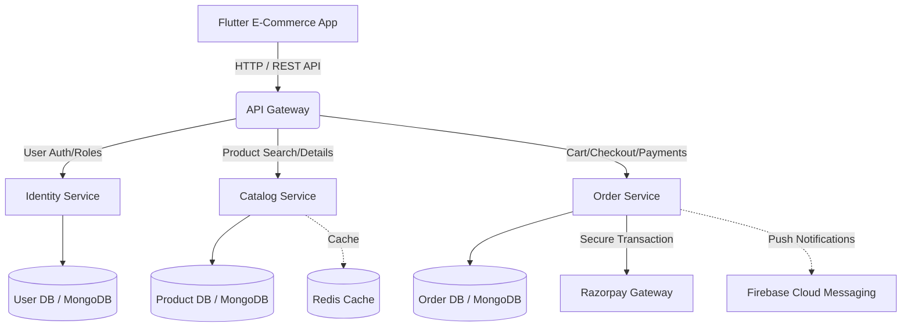

# PROJECT ANALYSIS REPORT

## ACKNOWLEDGEMENT

The successful completion of this E-Commerce platform would not have been possible without the support, guidance, and assistance of various individuals and resources. We would like to express our profound gratitude to our mentors, the open-source community, and the developers of the frameworks and libraries utilized in this project, notably the Flutter and Node.js ecosystems. Their comprehensive documentation and active community support played a crucial role in overcoming technical challenges. We also extend our thanks to our peers for their constructive feedback and continuous encouragement throughout the software development lifecycle.

## ABSTRACT

The rapid digital transformation of the retail industry demands robust, scalable, and user-centric E-Commerce solutions. This document presents a comprehensive analysis of a modern E-Commerce platform built utilizing a microservices architecture. The system leverages Dart (Flutter) to deliver a seamless, cross-platform mobile application interface and Node.js for a highly scalable, distributed backend infrastructure. By dividing the backend into independent services—Identity, Catalog, and Order management—connected via an API Gateway, the system guarantees high availability and fault tolerance. Key features include real-time synchronization, secure Razorpay payment gateway integration, advanced state management using Riverpod, and a dedicated admin interface for business analytics. This report outlines the project lifecycle from requirement gathering and system design to comprehensive testing and future scope planning.

## INTRODUCTION

### Project Summary
This project is an end-to-end, cross-platform E-Commerce solution designed to facilitate seamless online buying and selling. It includes a comprehensive consumer-facing mobile application and an integrated admin management suite. Core functionalities of the consumer application encompass secure user authentication, intelligent product catalog browsing, cart and checkout management, wishlists, and order tracking. The administrative features provide control over product listings, category management, promotions, and real-time business analytics.

### Purpose
The primary purpose of this E-Commerce platform is to bridge the gap between retailers and consumers by providing an accessible, fast, and secure digital marketplace. It aims to eliminate traditional bottlenecks in online shopping by implementing a distributed backend architecture that dynamically scales during high-traffic events (e.g., flash sales). For administrative users, the purpose is to provide actionable insights and streamlined inventory control to ensure efficient business operations.

### Language (Node, Dart)
The solution is primarily built utilizing two core technologies: 
*   **Dart (Flutter):** The consumer and admin applications are designed using Flutter, dart's UI toolkit. This ensures a consistent, native-like performance and 60-120fps animations across both iOS and Android platforms from a single codebase. It utilizes Riverpod for reactive state management, enabling clean and maintainable business logic separation.
*   **Node.js (JavaScript/TypeScript ecosystem):** The backend infrastructure relies on Node.js running an Express-based microservices architecture. Node's non-blocking, event-driven architecture is ideally suited for handling concurrent E-Commerce transactions, real-time WebSocket notifications, and rapid microservice interconnectivity. 

## PROJECT MANAGEMENT

### Project Planning and Scheduling
The project was executed using the Agile Scrum methodology to ensure continuous delivery and iterative improvements. Planning was divided into multi-week sprints, beginning with requirements analysis and backend schematic design, followed by frontend prototyping, API integration, and continuous quality assurance. Daily stand-ups and bi-weekly sprint reviews were utilized to track progress and realign deliverables with the primary project goals.

### Project Development Approach
The development approach embraced a decoupled, API-first strategy:
1.  **Backend:** A microservices pattern was adopted. Development was compartmentalized into building specific services (`identity-service`, `catalog-service`, `order-service`) connected via an `api-gateway`.
2.  **Frontend:** Clean Architecture was employed in the Flutter application. Features were modularized (e.g., `checkout`, `product`, `admin_analytics`), ensuring low coupling and high cohesion.

### Project Plan
1.  **Phase 1 - Inception & Requirement Gathering:** Defining scope, identifying user roles, and drafting architecture.
2.  **Phase 2 - UI/UX Prototyping:** Designing wireframes, user flows, and a unified design language system.
3.  **Phase 3 - Backend & Database Infrastructure:** Configuring MongoDB clusters, Redis caching, and building core microservices.
4.  **Phase 4 - Frontend Engineering:** Implementing localized modules, Riverpod state controllers, and Riverpod Generator implementations.
5.  **Phase 5 - Integration & Payment Gateway:** Integrating Razorpay, Firebase Authentication, and testing microservice-to-frontend communications.
6.  **Phase 6 - QA & Deployment:** Rigorous automated and manual testing, followed by staged production rollouts.

### Schedule Representation
The schedule was maintained using standard project tracking tools mimicking a Gantt chart structure:
*   **Weeks 1-2:** Requirement Analysis & Architecture Design
*   **Weeks 3-4:** UI/UX Design & Frontend Setup
*   **Weeks 5-7:** Backend Microservices Development (Auth, Catalog)
*   **Weeks 8-9:** Order Service & Payment Gateway Integration
*   **Weeks 10-11:** End-to-End API Integration with Flutter App
*   **Week 12:** System Testing, Bug Fixes & Refactoring
*   **Week 13+:** Production Release & Maintenance

## SYSTEM REQUIREMENTS STUDY

**Hardware Requirements:**
*   *Server-side:* Cloud-hosted instances with minimum 4 vCPUs, 8GB RAM, and SSD storage to handle multiple Node.js microservices and Redis/MongoDB clusters.
*   *Client-side:* Any standard Android device (Android 6.0+) or iOS device (iOS 11.0+) with functional internet connectivity.

**Software Requirements:**
*   **Backend:** Node.js, Express.js, MongoDB, Redis, Jest (for testing).
*   **Frontend:** Flutter SDK (>=3.11.0), Dart SDK.
*   **Third-Party APIs:** Razorpay API for transactions, Firebase for push notifications and optional social/federated authentication.
*   **Tools:** Git, Docker (for microservice containerization), Postman for API testing.

## SYSTEM ANALYSIS

**Existing System:**
Traditional monolithic E-Commerce platforms often suffer from tight coupling. If the order processing module fails during a traffic surge, the entire application, including the product catalog, can go down, causing substantial revenue loss. Additionally, maintaining multi-platform codebases (separate Swift and Kotlin repositories) requires significant overhead.

**Proposed System:**
The proposed system directly addresses these flaws. By separating the backend into microservices (`identity`, `catalog`, `order`), a failure in one service does not cripple the entire application. The use of Flutter allows a single engineering team to maintain iOS and Android iterations simultaneously. Redis caching minimizes database hits for frequently accessed product catalogs, radically improving load times. 

**Feasibility Study:**
*   **Technical Feasibility:** The use of proven open-source frameworks (Node, Flutter, MongoDB) guarantees strong community support and longevity.
*   **Economic Feasibility:** Cloud-native microservices allow dynamic scaling, meaning computing resources (and costs) are only expanded precisely when heavy traffic necessitates it.

## SYSTEM DESIGN

The system follows a highly modular, decoupled architecture prioritizing speed and security.

### Microservices Architecture
1.  **API Gateway:** The central entry point for the mobile application. It routes incoming requests to the appropriate downstream microservice and handles global rate-limiting.
2.  **Identity Service:** Manages user registration, JWT-based profile authentication, and role-based access control (Admin vs. Consumer).
3.  **Catalog Service:** Handles product listings, categories, inventory levels, and search aggregation.
4.  **Order Service:** Manages the cart ecosystem, processes checkout logic, communicates with Razorpay, and logs transactions.

### Flow Chart

## TESTING

### Testing Plan
The testing plan ensures all microservices behave as expected individually and connected, while the mobile client accurately renders data and handles edge cases gracefully. The CI/CD pipeline runs unit and integration tests upon every commit.

### Testing Strategy
A Test-Driven Development (TDD) approach was integrated into the backend environment. The strategy splits testing into automated API validation (using Jest & Supertest) and manual user-acceptance testing (UAT) for the mobile app interface.

### Testing Methods
*   **Unit Testing:** Isolated testing of individual functions, Riverpod providers in Dart, and helper functions in Node.js.
*   **Integration Testing:** Verifying communication between the API Gateway and underlying microservices.
*   **End-to-End (E2E) Testing:** Testing complete consumer workflows, such as user registration followed by product search, cart addition, and successful checkout viewing. 
*   **Load Testing:** Simulating high concurrent user traffic against the Catalog service to test Redis caching efficiency.

### Testing Cases
| Test ID | Module | Scenario | Expected Outcome | Pass/Fail |
| :--- | :--- | :--- | :--- | :--- |
| TC-01 | Auth | User attempts login with invalid credentials. | Rejects login, returns localized error message. | Pass |
| TC-02 | Catalog | Scroll down the product list triggering pagination. | Next batch of products loads seamlessly via Skeletonizer. | Pass |
| TC-03 | Cart | Applying an invalid/expired promo code. | Displays 'Invalid Coupon' error, UI prevents discount application. | Pass |
| TC-04 | Payment | Razorpay payment fails mid-transaction. | Order status sets to 'Pending/Failed', user is redirected to retry. | Pass |
| TC-05 | Admin | Admin modifies product price. | Price updates across Catalog service and reflects instantly in consumer app. | Pass |

## LIMITATION & FUTURE ENHANCEMENT

### Limitations
1.  **Network Dependence:** As a cloud-hosted microservice platform, the application behavior degrades heavily during poor network connectivity, despite limited local caching mechanism via Hive on the Flutter client.
2.  **Infrastructure Overhead:** Running multiple independent microservices introduces DevOps complexity compared to a traditional monolithic backend.

### Future Enhancement
1.  **AI Product Recommendations:** Integrating an AI-driven recommendation engine using collaborative filtering to suggest products based on user browsing history.
2.  **AR Try-On Experience:** Implementing Augmented Reality (AR) utilizing Flutter camera plugins to allow users to visualize products (e.g., furniture, apparel) in their physical space before purchasing.
3.  **Multi-language & Multi-currency Support:** Expanding the platform to support internationalization for diverse global markets.

## CONCLUSION AND DISCUSSION

The development of this E-Commerce platform successfully demonstrates the efficacy of combining a Node.js microservices backend with a Flutter-based mobile frontend architecture. The system successfully solves the problems of scalability and multi-platform maintenance natively found in legacy applications. The decoupled nature of the Identity, Catalog, and Order services ensures the platform remains highly available, while the integration of modern UI libraries (Riverpod, Skeletonizer, Fl_Chart) empowers the administrative and consumer interfaces with fluid, responsive user experiences. Ultimately, the project lays a highly resilient foundation capable of scaling into a large-scale enterprise enterprise application.

## REFERENCES

1.  Flutter Documentation: https://flutter.dev/docs
2.  Node.js Official Documentation: https://nodejs.org/en/docs/
3.  Mongoose ORM references: https://mongoosejs.com/
4.  Microservices Architecture Guide: *Building Microservices* by Sam Newman.
5.  Razorpay API Integration Guide: https://razorpay.com/docs/api/
6.  Riverpod State Management: https://riverpod.dev/
7.  Dart Language Specification: https://dart.dev/guides
