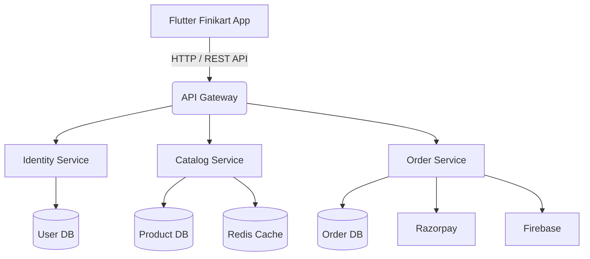

# PROJECT ANALYSIS REPORT

## ACKNOWLEDGEMENT

The successful completion of the Finikart platform is the result of sustained effort, structured planning, and collaborative problem-solving. We would like to express our sincere gratitude to our mentors and academic guides for their continuous support, technical insights, and valuable feedback throughout the development lifecycle of this project.

We are equally thankful to the global open-source community, whose contributions significantly accelerated the development process. Technologies such as Flutter, Node.js, MongoDB, and Redis provided a strong foundation, while their extensive documentation and community discussions helped resolve complex technical challenges efficiently.

Special appreciation is extended to the contributors of libraries such as Riverpod, Express.js, and other supporting tools that enabled us to implement scalable and maintainable solutions. We also thank our peers and testers for their constructive feedback during various stages of testing, which helped identify usability issues, optimize performance, and strengthen system reliability.

Lastly, we acknowledge the importance of modern development tools, cloud infrastructure, and DevOps practices that made it possible to design, build, test, and deploy this system effectively.

---

## ABSTRACT

The transformation of traditional retail into a digital-first ecosystem has significantly increased the demand for scalable, secure, and user-centric e-commerce platforms. This report presents a comprehensive analysis of Finikart, a modern cross-platform e-commerce solution designed using a microservices-based architecture.

The system leverages Flutter (Dart) to deliver a consistent and high-performance mobile application experience across Android and iOS devices. On the backend, Node.js powers a distributed microservices architecture, ensuring efficient handling of concurrent requests and improved scalability.

The backend is divided into independent services—Identity Service, Catalog Service, and Order Service—connected through an API Gateway. This architectural approach ensures fault isolation, maintainability, and high availability. Additional integrations such as Razorpay for secure payment processing, Firebase for notifications, and Redis for caching significantly enhance performance and user experience.

This report covers the complete lifecycle of the project, including requirement analysis, system design, development methodology, testing strategies, deployment architecture, limitations, and future enhancements. The findings highlight how modern technologies and architectural patterns can be effectively utilized to build enterprise-grade digital commerce platforms.

---

## INTRODUCTION

### Project Summary

Finikart is a full-scale e-commerce platform designed to provide a seamless and efficient online shopping experience. The system consists of two primary components:

1. A consumer-facing mobile application  
2. An administrative management system  

The consumer application enables users to register, browse products, apply filters, manage carts, and track orders in real time. The user interface is optimized for performance and usability, ensuring smooth navigation and fast response times.

The administrative system allows business operators to manage products, categories, pricing, inventory, and promotional campaigns. It also provides real-time analytics dashboards that help monitor sales performance and customer behavior.

### Purpose

The primary purpose of the Finikart platform is to bridge the gap between traditional retail systems and modern digital marketplaces. It aims to provide:

- A scalable and reliable platform for online transactions  
- A user-friendly shopping experience  
- Efficient inventory and order management for administrators  

The system is also designed to handle peak traffic scenarios such as flash sales through dynamic scaling, ensuring uninterrupted service availability.

### Language (Node, Dart)

**Dart (Flutter):**  
Flutter enables the development of cross-platform applications using a single codebase. It provides high performance through its native rendering engine and allows rapid UI development using a widget-based architecture. Riverpod is used for state management to ensure modular and maintainable code.

**Node.js (JavaScript/TypeScript):**  
Node.js powers the backend using an event-driven, non-blocking architecture. This makes it highly suitable for handling multiple concurrent requests. Express.js is used as the web framework, and the system is structured into microservices for better scalability and maintainability.

---

## PROJECT MANAGEMENT

### Project Planning and Scheduling

The project was developed using Agile Scrum methodology, allowing iterative progress and continuous feedback. Work was divided into sprints, each focusing on specific deliverables such as backend services, UI modules, or integrations.

Daily stand-up meetings ensured team alignment, while sprint reviews and retrospectives helped refine development strategies.

### Project Development Approach

A modular and API-first approach was followed:

- Backend services were developed independently  
- Frontend followed Clean Architecture principles  
- Git was used for version control with proper branching strategies  

This approach improved scalability, maintainability, and team collaboration.

### Project Plan

1. Requirement Analysis  
2. UI/UX Design  
3. Backend Development  
4. Frontend Development  
5. Integration  
6. Testing & Deployment  

### Schedule Representation

- Weeks 1–2: Requirement Analysis  
- Weeks 3–4: UI/UX Design  
- Weeks 5–7: Backend Development  
- Weeks 8–9: Payment Integration  
- Weeks 10–11: System Integration  
- Week 12: Testing  
- Week 13+: Deployment  

---

## SYSTEM REQUIREMENTS STUDY

## USER CHARACTERISTICS

The users of the Online Store Product Purchase System can be broadly categorized into two primary groups: **Customer Users** and **Admin Users**. Each group has distinct roles, expectations, and interaction patterns with the system.

---

### 1. Customer Users

Customer users are the end-users of the platform who interact with the system to browse products, make purchases, and manage their orders.

#### Characteristics

- Possess **basic knowledge of web browsers** and can navigate websites or mobile applications with ease.  
- Capable of performing common actions such as **registration, login, product search, adding items to cart, and completing purchases**.  
- Interested in finding **quality products at reasonable prices**, along with clear product descriptions and availability.  
- Expect a **clean, intuitive, and user-friendly interface** that minimizes effort and reduces confusion.  
- Prefer **fast-loading pages**, seamless navigation, and a smooth checkout process.  
- Value **secure payment options**, including multiple payment methods such as UPI, cards, and digital wallets.  
- Appreciate features like **order tracking, wishlist management, and personalized recommendations**.  
- Expect **reliable customer support** and transparent policies (returns, refunds, delivery timelines).

---

### 2. Admin Users

Admin users are authorized personnel responsible for managing the platform’s operations through an administrative dashboard.

#### Characteristics

- Possess **basic to intermediate technical skills**, particularly in using web-based management systems and dashboards.  
- Capable of performing administrative tasks such as:
  - Adding, updating, and deleting products  
  - Managing inventory and stock levels  
  - Monitoring customer orders and transactions  
  - Handling user accounts and resolving issues  

- Responsible for overseeing **daily system operations**, including order processing, product availability, and overall platform performance.  
- Expect a **secure, structured, and efficient admin interface** with role-based access control.  
- Prefer tools that **automate repetitive tasks**, reduce manual workload, and improve operational efficiency.  
- Require **real-time analytics and reporting features** to make informed business decisions.  
- Value **data accuracy, system reliability, and quick access to critical information**.

---

### Summary

Understanding user characteristics is essential for designing a system that meets both customer expectations and administrative requirements. While customers prioritize simplicity, speed, and convenience, admin users focus on control, efficiency, and data management. A well-balanced system ensures a seamless experience for both user groups.

### Hardware Requirements

- Server: Minimum 4 vCPU, 8GB RAM, SSD storage  
- Client: Android 6+ / iOS 11+ devices  

### Software Requirements

- Backend: Node.js, Express.js, MongoDB, Redis  
- Frontend: Flutter SDK, Dart  
- APIs: Razorpay, Firebase  
- Tools: Git, Docker, Postman  

---

## SYSTEM ANALYSIS

### Existing System

Traditional monolithic systems suffer from tight coupling, limited scalability, and higher maintenance complexity. Failures in one module can affect the entire system.

### Proposed System

The microservices architecture separates functionalities into independent services, ensuring better fault tolerance and scalability. Flutter reduces development overhead by providing a single codebase for multiple platforms.

### Feasibility Study

- Technical: Strong ecosystem and community support  
- Economic: Cost-efficient cloud scaling  

---

## SYSTEM DESIGN

### Microservices Architecture

1. API Gateway  
2. Identity Service  
3. Catalog Service  
4. Order Service  

### Flow Chart

## SYSTEM DESIGN (DETAILED)

### API Gateway
- Central entry point  
- Handles routing and authentication  
- Provides rate limiting and logging  

### Identity Service
- User authentication  
- JWT token management  
- Role-based access control  

### Catalog Service
- Product management  
- Search and filtering  
- Redis caching for performance  

### Order Service
- Cart management  
- Checkout processing  
- Payment integration  

---

## DEPLOYMENT ARCHITECTURE

### Deployment Strategy
- Docker-based containerization  
- Cloud deployment (AWS / GCP / Azure)  
- CI/CD automation  

### Scalability
- Horizontal scaling  
- Load balancing  
- Auto-scaling  

### Monitoring
- Logging systems  
- Performance monitoring  
- Alert mechanisms  

---

## PERFORMANCE OPTIMIZATION

### Backend
- Redis caching  
- Efficient database queries  
- Asynchronous processing  

### Frontend
- Lazy loading  
- Optimized UI rebuilds  
- Efficient state management  

## TESTING

### Testing Plan

A comprehensive and structured testing plan was implemented to ensure that the Finikart platform meets all functional, performance, and security requirements. Testing was not treated as a final step but as a continuous process integrated throughout the development lifecycle.

The plan focused on validating:
- Individual microservices independently  
- Communication between services via API Gateway  
- End-to-end user workflows  
- System behavior under real-world conditions  

Automated testing pipelines were configured within the CI/CD workflow so that every code commit triggered a suite of tests. This approach helped in early detection of bugs and reduced the risk of regression issues.

### Testing Strategy

The testing strategy combined multiple modern approaches:

- **Test-Driven Development (TDD):**  
  Backend logic was developed alongside test cases to ensure correctness from the initial stage.

- **Behavior-Driven Development (BDD):**  
  Focused on user scenarios and expected behaviors, especially useful for validating UI interactions.

- **Staging Environment Testing:**  
  A staging environment was used to simulate production conditions, ensuring that integrations such as payment gateways and notifications worked reliably before deployment.

### Testing Methods

* **Unit Testing:**  
  Each function, module, and component was tested in isolation. For example, authentication logic, API handlers, and Riverpod providers were verified independently.

* **Integration Testing:**  
  Ensured that different microservices communicated correctly. This included testing API Gateway routing and verifying data consistency across services.

* **End-to-End (E2E) Testing:**  
  Simulated complete user journeys such as:
  - User registration → login → browsing → add to cart → checkout  
  This ensured that the entire system worked seamlessly.

* **Load Testing:**  
  Simulated thousands of concurrent users accessing the system to evaluate performance, response times, and server stability. Redis caching efficiency was also analyzed under load.

* **Security Testing:**  
  Identified vulnerabilities such as:
  - Unauthorized API access  
  - Token manipulation  
  - Injection attacks  
  Security measures like JWT validation and input sanitization were rigorously tested.

### Testing Cases

| Test ID | Module | Scenario | Expected Outcome | Status |
| :--- | :--- | :--- | :--- | :--- |
| TC-01 | Authentication | Invalid login attempt | Error message displayed | Pass |
| TC-02 | Catalog | Infinite scroll pagination | Smooth loading of products | Pass |
| TC-03 | Cart | Invalid coupon applied | Discount rejected | Pass |
| TC-04 | Payment | Transaction failure | Retry option shown | Pass |
| TC-05 | Admin | Update product details | Changes reflected instantly | Pass |
| TC-06 | Security | Unauthorized API access | Access denied | Pass |
| TC-07 | Performance | High traffic simulation | Stable performance | Pass |

---

## LIMITATIONS & FUTURE ENHANCEMENT

### Limitations

1. **Network Dependency:**  
   The system heavily relies on internet connectivity. Poor network conditions can affect user experience despite partial caching mechanisms.

2. **Infrastructure Complexity:**  
   Microservices architecture requires advanced DevOps practices, making deployment and monitoring more complex compared to monolithic systems.

3. **Initial Development Overhead:**  
   Setting up independent services, API Gateway, and communication layers increases initial development time.

4. **Third-Party Dependencies:**  
   Dependence on services like payment gateways and cloud providers introduces risks such as downtime or API changes.

---

### Future Enhancements

1. **AI-Based Recommendation Engine:**  
   Implement machine learning models to suggest products based on user behavior and purchase history.

2. **Augmented Reality (AR) Features:**  
   Allow users to visualize products in real-world environments using device cameras.

3. **Multi-language and Multi-currency Support:**  
   Expand the platform for global users with localization features.

4. **Progressive Web Application (PWA):**  
   Provide a web-based version with offline support and faster loading times.

5. **Advanced Analytics Dashboard:**  
   Introduce predictive analytics, sales forecasting, and customer segmentation tools.

6. **Voice Search & Chatbot Integration:**  
   Enhance accessibility and support through AI-powered assistants.

---

## DEPLOYMENT ARCHITECTURE

### Deployment Strategy

The application follows a cloud-native deployment model using containerization and automated pipelines.

**Key Steps:**
1. Code is pushed to the repository  
2. CI pipeline runs automated tests  
3. Docker images are built  
4. Images are deployed to cloud infrastructure  
5. Services are scaled dynamically  

### Technologies Used

- Docker for containerization  
- Cloud platforms (AWS / GCP / Azure)  
- CI/CD tools (GitHub Actions, Jenkins)  

### Scalability

- Horizontal scaling of services  
- Load balancing across instances  
- Auto-scaling based on traffic  

### Monitoring & Logging

- Centralized logging systems  
- Real-time performance monitoring  
- Alert notifications for failures  

---

## PERFORMANCE OPTIMIZATION

### Backend Optimization

- Redis caching to reduce database queries  
- Efficient indexing in MongoDB  
- Asynchronous request handling  

### Frontend Optimization

- Lazy loading of components and images  
- Optimized Flutter widget rebuilds  
- Efficient state management using Riverpod  

### Network Optimization

- API response compression  
- Reduced payload sizes  
- CDN usage for static assets  

---

## USER EXPERIENCE (UX) CONSIDERATIONS

### Design Principles

- Simple and intuitive interface  
- Consistent design across screens  
- Fast response time  
- Minimal user effort  

### Key UX Features

- Smooth animations  
- Skeleton loaders for perceived performance  
- Clear error handling  
- Streamlined checkout process  

### Accessibility

- Screen reader compatibility  
- Adjustable text sizes  
- High-contrast UI themes  

---

## RISK ANALYSIS

### Potential Risks

1. System downtime due to server failure  
2. Security breaches or data leaks  
3. Performance degradation under heavy load  
4. Third-party service outages  

### Mitigation Strategies

- Redundant server architecture  
- Regular security audits  
- Load testing and optimization  
- Backup and disaster recovery systems  

---

## CONCLUSION AND DISCUSSION

The Finikart platform successfully demonstrates the implementation of a scalable, secure, and high-performance e-commerce system using modern technologies and architectural patterns.

By adopting microservices architecture, the system achieves flexibility, fault isolation, and scalability. Flutter ensures efficient cross-platform development, while Node.js provides a robust backend capable of handling high concurrency.

The project effectively addresses key challenges such as system performance, user experience, and maintainability. Although certain limitations exist, they are manageable and can be improved through future enhancements.

With continuous development and integration of advanced technologies such as AI and AR, Finikart has strong potential to evolve into a next-generation enterprise-level e-commerce platform.

---

## REFERENCES

1. Flutter Documentation: https://flutter.dev/docs  
2. Node.js Documentation: https://nodejs.org/en/docs/  
3. MongoDB Documentation: https://mongoosejs.com/  
4. Redis Documentation: https://redis.io/docs/  
5. Razorpay API Docs: https://razorpay.com/docs/api/  
6. Riverpod Docs: https://riverpod.dev/  
7. Docker Docs: https://docs.docker.com/  
8. Firebase Docs: https://firebase.google.com/docs  
